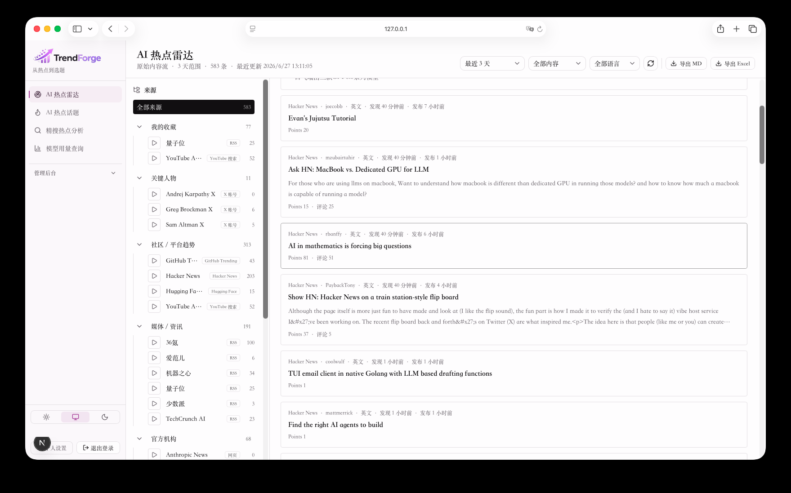
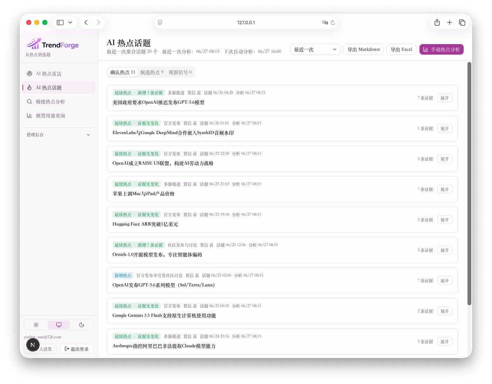
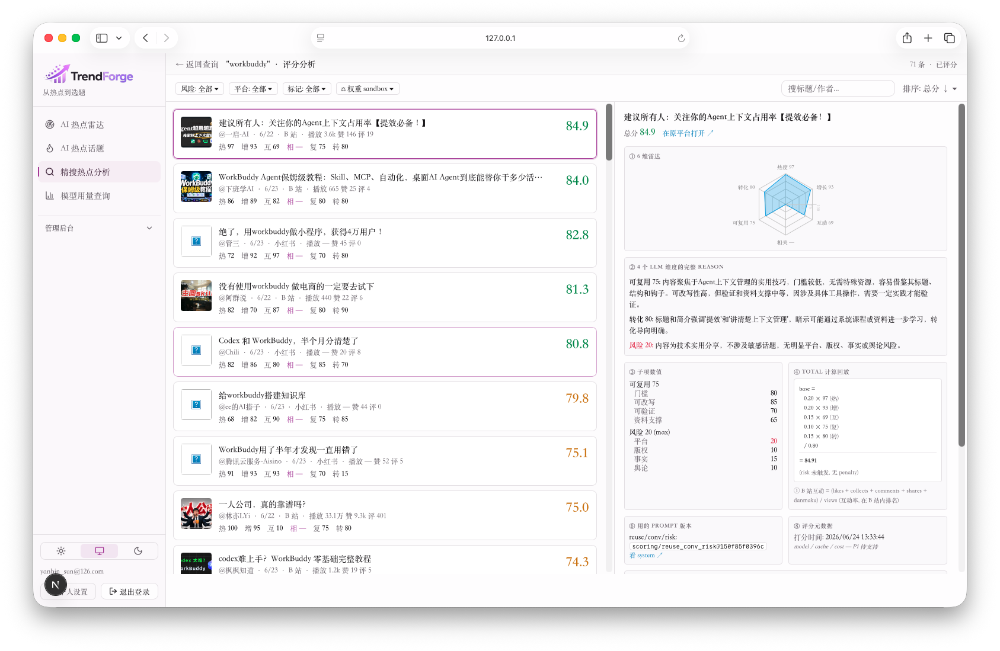
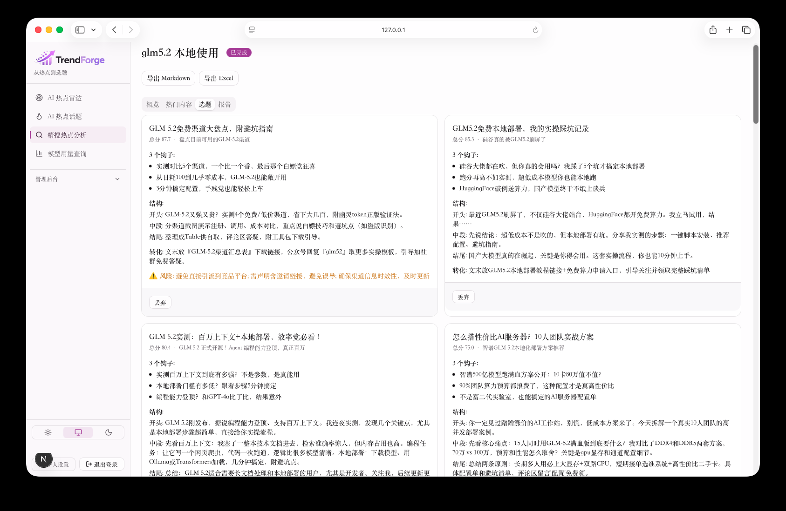
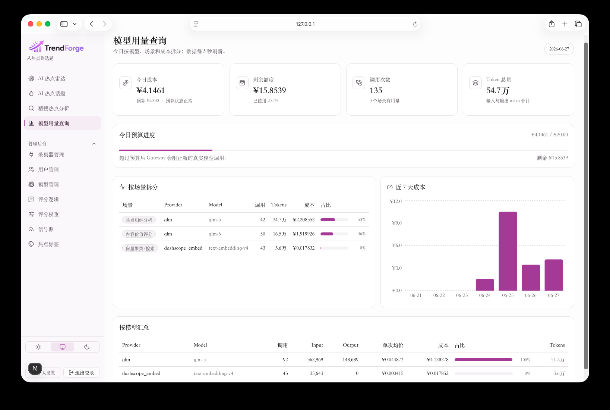

# TrendForge — AI Trend Discovery & Analysis Platform

**A full-stack, AI-native platform that turns raw signals from across the web into scored, ranked, report-ready trend insights — automatically.**

Built end to end for a client: data collection → cleaning → AI scoring → topic selection → report generation → export. A custom multi-provider LLM gateway, semantic clustering, and a 7-dimension scoring engine — running as a 6-service containerized system with 370+ automated backend tests.

> *Case study by **Ethan Sun** — Senior AI Engineer. Built for a client; presented with permission and anonymized (client company name & logo removed). Source code is private; this page documents the architecture, engineering, and results.*
> 📧 ethan@ethansun.dev · 🌐 https://ethansun.dev

---

▶️ **Watch the 90-second walkthrough:** [Watch the demo on YouTube](https://youtu.be/l5fbeU_zf4A)

---

## The problem it solves

Teams that need to stay ahead of fast-moving topics (AI, tech, content) drown in scattered signals — papers, repos, forums, social posts, product launches. Reading it all is impossible; doing it manually is slow and inconsistent.

TrendForge automates the whole loop: it continuously pulls signals from many sources, de-duplicates and cleans them, uses LLMs to score and cluster what matters, and produces ranked topic picks and structured reports a team can act on — in minutes, for cents.

## AI Hotspot Radar & topic aggregation

Background workers continuously collect from many signal sources in parallel. The system then auto-aggregates the live stream into named, de-duplicated topics, tracked across runs — and exports to Markdown / Excel.

## Precise analysis, scoring & reports

Search by keyword, platform, and audience persona. Every result is scored across **7 dimensions** — 3 deterministic numeric signals + 4 LLM-judged — visualized as a radar chart, with configurable weights and thresholds. The system generates topic picks and a structured multi-chapter report, then exports to Markdown / Excel.

## A custom LLM gateway — cost & usage you can see

Not a thin API wrapper — production-grade LLM infrastructure: provider abstraction and routing across multiple models, a **two-tier cache** (Redis L1 + PostgreSQL L2), and **per-budget cost controls**. Every model call is tracked, with cost curves and budget guards. A full run over **175 pieces of content costs about $0.07** — built to stay cheap and reliable at scale.

---

## Architecture & tech

| Layer | Stack |
|---|---|
| **Backend** | FastAPI · Celery · SQLAlchemy 2.0 (async) · PostgreSQL · Redis |
| **Frontend** | Next.js 16 (App Router) · React · Tailwind 4 · shadcn/ui · SSE live updates |
| **AI/ML** | Custom LLM gateway (multi-provider) · embeddings · UMAP + HDBSCAN clustering · 7-dimension scoring |
| **Infra** | Dockerized 6-service stack · single-port reverse proxy · Fernet-encrypted credentials · JWT auth · Alembic migrations |
| **Quality** | 370+ passing backend tests · end-to-end smoke tests across the full pipeline |

## Results

- **End-to-end automation** — a full topic-discovery run completes in ~14 minutes, producing named clusters from 175+ items for **~$0.07** in model cost.
- **Built for scale & reliability** — async pipeline, caching, budget guards, and per-source fault isolation.
- **Production-shaped** — auth, admin tooling, migrations, backups, exports, containerized deployment — not a prototype.

---

## Work with me

I build AI-powered apps, agents, and automations — LLM integrations, RAG, MVPs, and full-stack delivery — and I work US business hours from Asia.

**Have an idea or a process you want automated with AI? Tell me the outcome you want — I'll tell you how to get there.**

📧 **ethan@ethansun.dev** · 🌐 **https://ethansun.dev**
